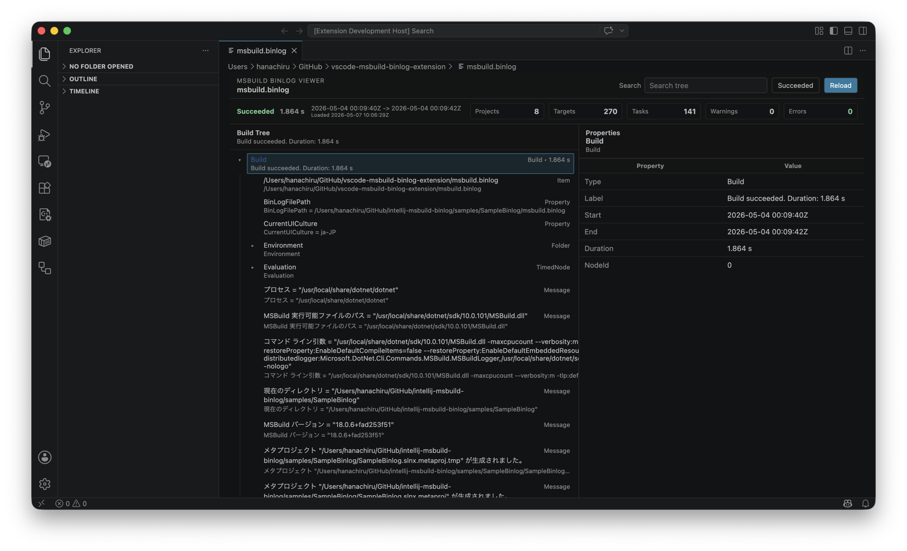

# MSBuild Binlog Viewer for VS Code

[English README](./README.md)

MSBuild Binlog Viewerは、MSBuildの`.binlog`を専用 Viewerで開いて確認するためのVS Code拡張機能です。

## 使い方

1. `.binlog` ファイルを VS Code で開きます

## Viewer について

- 上部にサマリーを表示
- 左側にビルドツリーを表示
- 右側に選択したノードのプロパティを表示

## ライセンス

MIT
